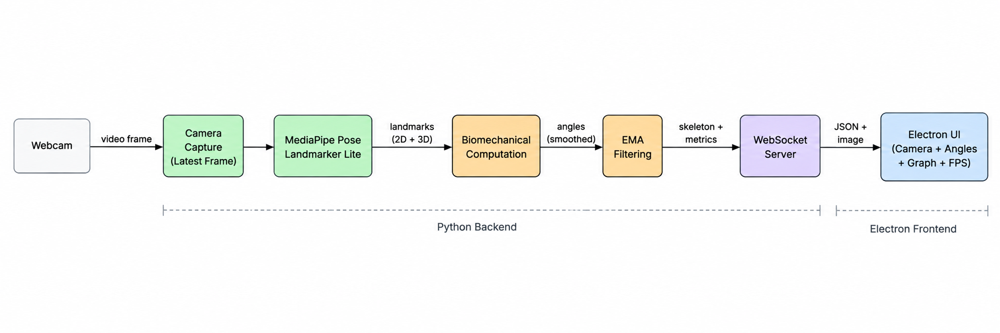

# Real-Time Biomechanical Analysis System

A real-time desktop application that estimates human joint angles from a
single monocular webcam.

Built with **Python + MediaPipe + Electron**, the system performs local pose
estimation, biomechanical calculations, temporal smoothing, and real-time
visualization.

> **30–31 FPS end-to-end @ 640×480**

---

## Demo

<!-- Add screenshot / GIF / short demo video here -->

---

## Running Locally

### Prerequisites

- Python 3.11+
- Node.js & npm
- Webcam

### Setup

1. Install Python dependencies:
   `pip install -r requirements.txt`

2. Install frontend dependencies:
   `cd frontend`
   `npm install`

### Run

From the `frontend` directory:

`npm start`

Electron automatically starts the Python backend and opens the application. The pose-estimation pipeline runs locally using the connected webcam.

## What It Measures

| Joint | Measurements |
|---|---|
| Elbow | Flexion / Extension |
| Knee | Flexion / Extension |
| Shoulder | Flexion / Extension, Abduction / Adduction |
| Hip | Flexion / Extension |
| Ankle | Dorsiflexion / Plantarflexion |

Measurements are calculated bilaterally where applicable.

---

## Architecture



Python handles the complete real-time processing pipeline:

**Camera → Pose Estimation → Joint Geometry → Filtering → WebSocket**

Electron acts as the desktop presentation layer.

---

## Key Engineering Decisions

### 2D vs 3D geometry

Different joints use different representations based on the observed pose
estimation behavior:

- **Elbow:** 2D image-plane geometry
- **Shoulder:** 2D image-plane geometry
- **Knee:** 3D world coordinates
- **Hip:** 3D world coordinates
- **Ankle:** 3D world coordinates

For example, MediaPipe's estimated depth introduced noticeable error for
straight-arm elbow measurements, so the elbow calculation uses image-plane
geometry instead.

### Real-time processing

A dedicated camera-capture thread maintains a **latest-frame buffer**.
Stale frames are discarded rather than queued.

This keeps the application responsive and resulted in:

**30–31 FPS end-to-end**

Detailed measurements are available in [`PerformanceReport.md`](PerformanceReport.md).

---

## Validation

The project includes:

- Unit tests for geometry and all biomechanical measurements
- Hardcoded 3D coordinate tests
- Squat video validation
- Knee-angle-over-time graph
- Validation video with skeleton and calculated angles
- Shoulder out-of-plane validation

Run all tests:

```powershell
$env:PYTHONPATH="backend"
python -m pytest backend/tests -v
```

## Limitations

This is a monocular pose-estimation system, so measurements are affected by
camera perspective, subject orientation, landmark accuracy, and estimated
depth.

The application does **not** automatically determine subject orientation;
users are instructed to position themselves appropriately for each
measurement.

The measurements are intended for biomechanical estimation and are not a
replacement for a clinically calibrated goniometer.

---

## Tech Stack

**Backend:** Python, MediaPipe, OpenCV, WebSocket

**Frontend:** Electron, HTML, CSS, JavaScript

**Testing:** Pytest

**Model:** MediaPipe Pose Landmarker Lite

---

## Project Structure

```text
backend/
├── biomechanics/
├── pose/
├── communication/
├── validation/
└── main.py

frontend/
models/
validation/
PerformanceReport.md
README.md
```